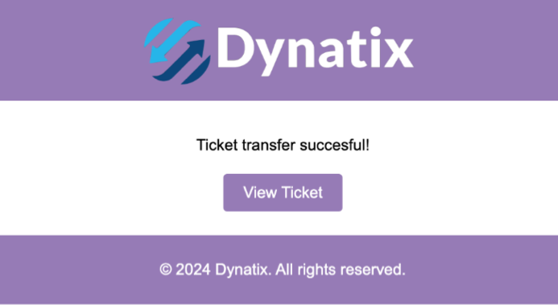

# Dynatix
Dynamic Ticketing without needing accounts

## Description

Dynatix is a ticketing platform designed to address the vulnerability posed by static QR/barcodes in small ticketing platforms. It aims to prevent ticket fraud and ensure the integrity of ticket sales and event attendance.

## Steps to Run

1. Open terminal
2. ```bash
    cd backend
    ```
3. ```bash
    npm run start
    ```
4. Run `openTicket.html`

## Usage

Visit the website and access the ticket with a two-factor authentication code sent to your phone number.


View the ticket in the form of a dynamic moving QR code.


Transfer the ticket by entering the recipient's phone number. 


Recipient must confirm the transfer with a two-factor authentication code.



Recipient can now view the ticket by following the same steps.

## Contributors

- Alex Evans
- Claris Paz
- Khushi Nakra
- Nadia Nafeesa Binti Rashid
